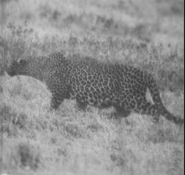
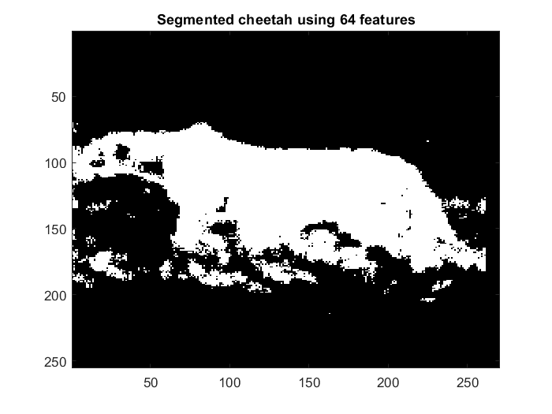
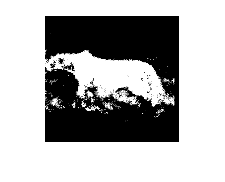
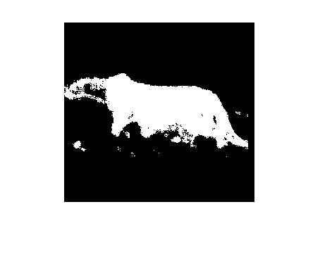

# Image_Segmentation_using_Statistical_Learning_Methods
Image segmentation of a chettah image using different statistical learning algortihms

This project aims to segment the following cheetah image into its two components, cheetah (foreground) and grass (background).



The goal is to obtain a mask image as follows:


## Discrete Cosine Transform(DCT)
To formulate this as a pattern recognition problem an observation space of 8x8 image blocks is used, i.e. each image as a collection of 8x8 blocks.
For each block DCT is computed as an array of 8 x 8 frequency coeffcients. Since cheetah and the grass have different
textures, with different frequency decompositions, the two classes can be better represented and seperated in the
frequency domain. Each 8 x 8 array is then converted into a 64 dimensional vector because it is easier
to work with vectors than with arrays. The file [Zig-Zag Pattern](naive_bayes/Zig-Zag Pattern.txt) contains the position (in the 1D vector) of each coeffcient in the 8 x 8 array.

## Training data
Each method contains a training set of vectors obtained from a similar image (stored as a matrix, each row is a training vector) for each
of the classes. There are two matrices, TrainsampleDCT BG and TrainsampleDCT FG for foreground
and background samples in each training set respectively. All training sets are .mat files.
1. Naive bayes - [Training set](naive_bayes/TrainingSamplesDCT_8.mat)
2. Maximum Likelihood estimation - [Training set](maximum_likelihood_estimation/TrainingSamplesDCT_8_new.mat)
3. Bayes Parameter Estimation - [Training set](bayesian_parameter_estimation/TrainingSamplesDCT_subsets_8.mat), [Priors](bayesian_parameter_estimation/Prior_1.mat)
4. Expectation Maximization - [Trainin set](expectation_maximization/TrainingSamplesDCT_8_new.mat)

## Probabilty of Error
Using the given ground truth image, we perform logical xor operation between ground truth image and the obtained segmented mask. Logical xor gives all the pixel locations where pixels don't match, taking sum of all such pixels gives the count of error pixels.

$$
Probabilty\ of\ error = \frac{Count\ of\ Error\ pixels}{Total\ number\ of\ pixels} 
$$

## Naive bayes
#### Segmentation of Cheetah
1. Using a $8\times8$ window, we slide through each pixel for the given image.
2. DCT for this $8\times8$ window is computed and then is converted into a feature vector using zig-zag sequence scanning.
3. Feature is taken as the second maximum element from the computed feature vector.
4. $P_{Y|X}(cheetah|x)$ and $P_{Y|X}(grass|x)$ are computed using Bayes rule.
	        $$P_{Y|X}(cheetah|x) = P_{X|Y}(x|cheetah)P_{y}(cheetah)$$
	        $$P_{Y|X}(grass|x) = P_{X|Y}(x|grass)P_{y}(grass)$$
5. From bayes decision rule,
```
if ($P_{Y|X}(cheetah|x)$ >= $P_{Y|X}(grass|x)$){
        y = 1;
}
else{
        y = 0;
}
```
6. Repeating above, class is assigned for each pixel and a segmentation mask is created.

#### Final Output
##### Probabilty of error =  0.1699


## Maximum Likelihood estimation
#### Segmentation of Cheetah
1. Using a $8\times8$ window, we slide through each pixel for the given image.
2. DCT for this $8\times8$ window is computed and then is converted into a feature vector using zig-zag sequence scanning.
3. Based on the problem asked we use all 64 features or the best eight features. Using these features class of the pixel is determined
4. From bayes decision rule,
        $$i^*(x) = argmin_i[d_i(x,\mu_i) + \alpha_i] $$ where
        $$d_i(x,y) = (x-y)^\top\Sigma_i^{-1}(x-y)$$
        $$\alpha_i = log(2\pi)^d|\Sigma_i| - 2logP_Y(i)$$
5. Repeating above steps for each pixel, class is assigned and a segmentation mask is created.

#### Final Output
##### Probability of error is 0.083573


## Bayesian Parameter Estimation
#### Classifying cheetah image using predictive solution
1. Using the dataset $D_i$ we compute the mean($\mu_{ML}$) and covariance matrix($\Sigma $) for both the foreground and background. 
2. Since $\Sigma_0$ is a function of $\alpha$, following steps are repeated in a loop.
3. It is given that $\Sigma_0$ is a diagonal matrix and we compute $\Sigma_0$ for every given $\alpha$ using the priors($w_i$) provided. $\Sigma_0$ is same for both foreground and background. $\mu_0$ is also provided for both the foreground and background along with the dataset.
4. Using $\mu_0$, $\mu_{ML}$, $\Sigma_0$ and $\Sigma$, $\mu_n$ and $\Sigma_n$ can be computed. 
5. Now, using a $8\times8$ window, we slide through each pixel for the given image.
6. DCT for this $8\times8$ window is computed and then is converted into a feature vector using zig-zag sequence scanning.
7. Using the values of $\mu_n$ and $\Sigma_n$, posterior probabilities of X given dataset i.e., $P_{X,T}(x,D)$ can be found for each class for the obtained feature vector.
8. Using the decision function for predictive distribution, each pixel of the image can be classified as a foreground or background. 
9. Repeating above steps for each pixel, class is assigned and a segmentation mask is created.

#### Final Output
##### Probability of error is 0.076


## Expectation Maximization
#### Segmentation of Cheetah
1. Using a $8\times8$ window, we slide through each pixel for the given image.
2. DCT for this $8\times8$ window is computed and then is converted into a feature vector using zig-zag sequence scanning.
3. Estimate mean, covariance and priors using EM quations.
4. Compute likelihood using the above obtained parameters.
5. Repeating above steps for each pixel, class is assigned and a segmentation mask is created.
#### Final Output
##### Probability of error is 0.0467
