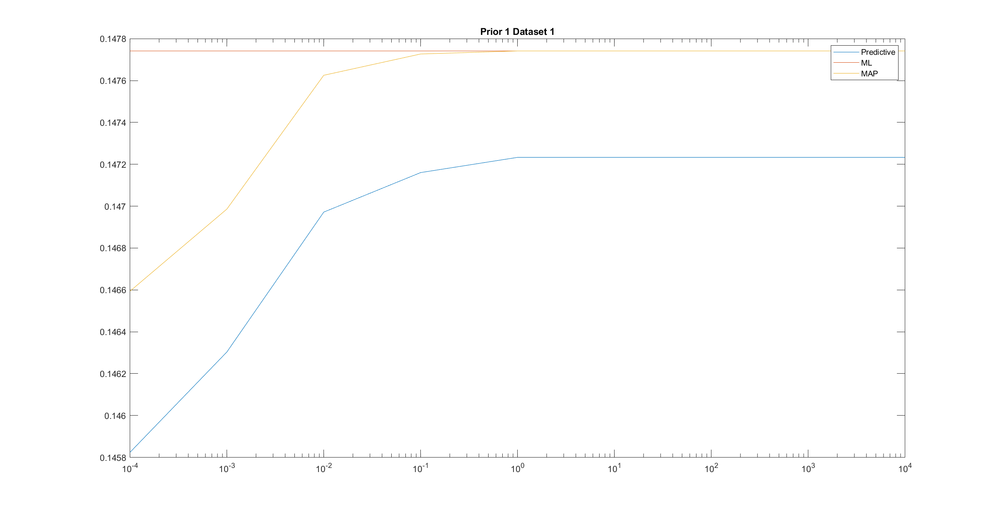
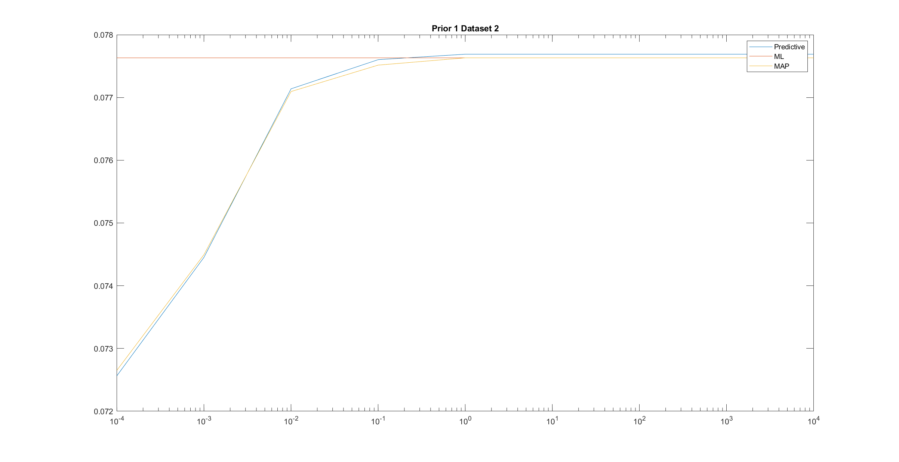
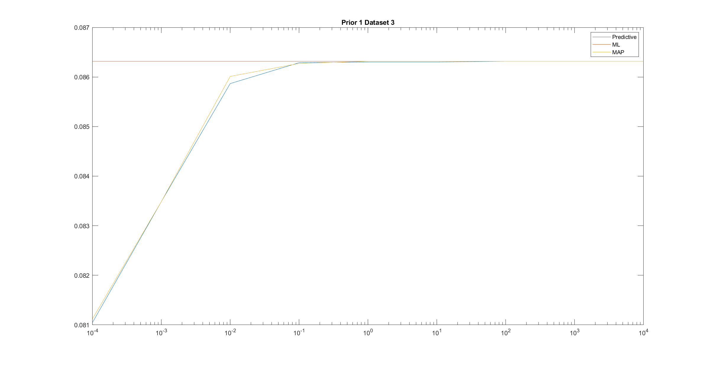
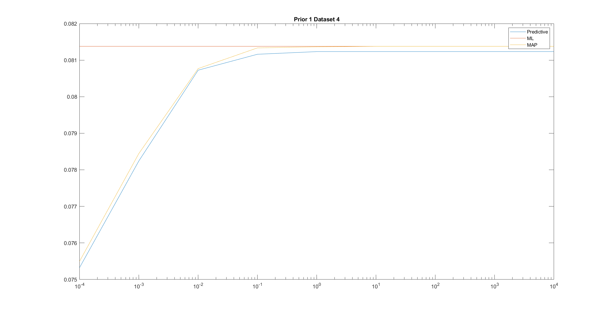
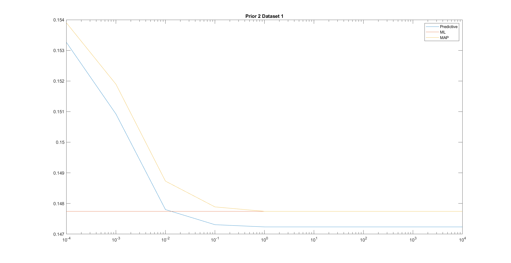
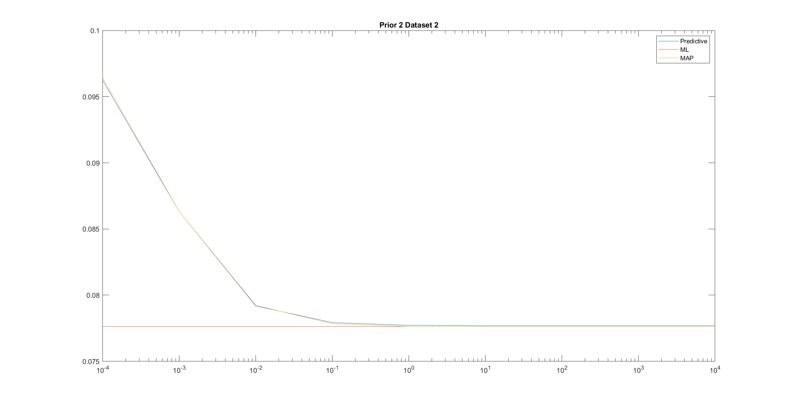
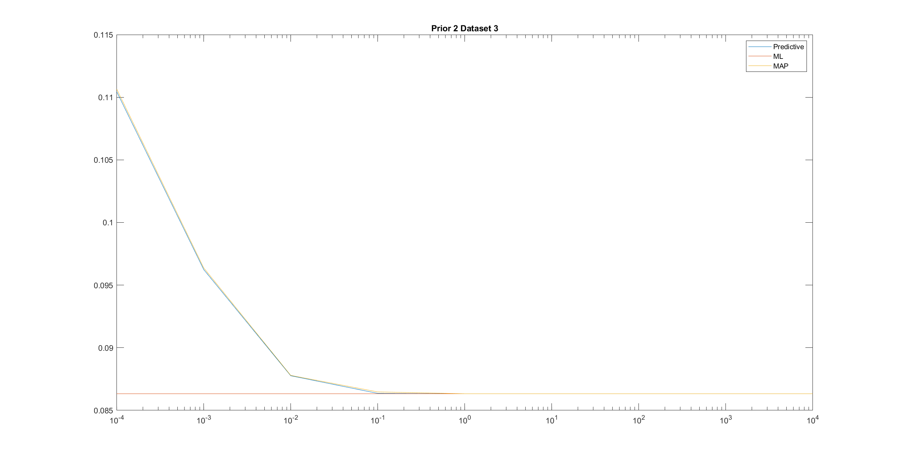
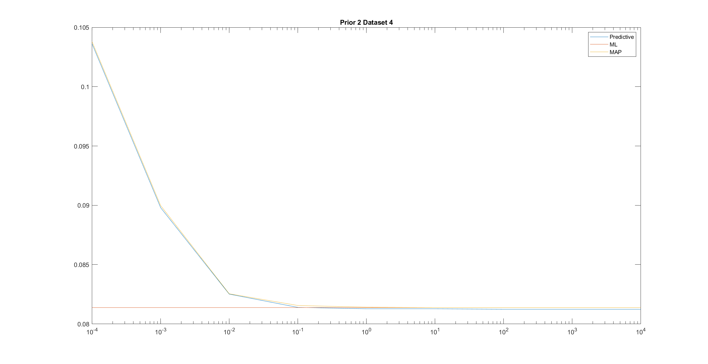
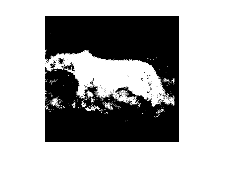

## Bayseian Parameter Estimation
## Predictive Solution
The decision function for predictive distribution is given as:
$$i^*(x) = argmin_i P_{X|Y,T}(x|i,D_i)P_Y(i)$$
where
$$P_{X,T}(x,D) = \int_{} P(X|\mu)P(\mu|D)d\mu$$
The posterior probability of $\mu$ given a dataset is defined using a Gaussian distribution with mean $\mu_n$ and covariance $\Sigma_n$
$$P_{\mu|T}(\mu|D) = G(\mu,\mu_n,\Sigma_n)$$
The class conditional probabilities are defined using Gaussian distribution as follows:
$$P_{x|\mu,\Sigma} = G(x,\mu,\Sigma)$$
1. $\Sigma$ is the covariance matrix of a given dataset $D_i$.
$$\Sigma = {1 \over N}\sum_{i=1}^{N}(x_i-\mu_{ML})(x_i-\mu_{ML})^{T}$$
where $\mu_{ML}$ is the ML estimate for the given dataset.
$$\mu_{ML} = {1 \over N}\sum_{i=1}^{N}x_i$$
2. $\mu$ has a Gaussian distribution.
$$P_{\mu}(\mu) = G(x,\mu_0,\Sigma_0) $$
where $\mu_0$ and $\Sigma_0$ are given as priors.
Therfore,
$$P_{X,T}(x,D) = G(x,\mu_n,\Sigma+\Sigma_n)$$
where $\mu_n$ and $\Sigma_n$ are defined as follows:
$$\mu_n = \Sigma_0(\Sigma_n + {1 \over n}\Sigma)^{-1}\mu_{ML} + {1 \over n}\Sigma(\Sigma_0 + {1 \over n}\Sigma)^{-1}\mu_{0}$$
$$\Sigma_n = \Sigma_0(\Sigma_0 + {1 \over n}\Sigma)^{-1}{1 \over n}\Sigma$$

## Classifying cheetah image using predictive solution
1. Using the dataset $D_i$ we compute the mean($\mu_{ML}$) and covariance matrix($\Sigma $) for both the foreground and background. 
2. We also compute the prior probabilities for each of the classes using ML estimate as shown below: 
   This histogram plot of the given dataset is of multinomial distribution. The observations have a probabilty distribution $P_k = \pi_k$ where $k = {1,2}$. Using the Maximum Likelihood estimate we obtain $\pi_k = {c_j \over n}$ where $c = {c_1,c_2}$ are the number of times that the observed value is $k$.
   In this problem $c_1 = 75$, $c_1 = 300$ and $n = c_1 + c_2 = 375$
   1. Prior probability of cheetah is 
        $P_{y}(cheetah) = P_1 = \pi_1 = {c_1 \over n}
            	               = {75 \over 375} = 0.2$
   2. Prior probability of grass is 
        $P_{y}(grass) = P_2 = \pi_2 = {c_2 \over n}
            	               = {300 \over 375} = 0.8$
3. Since $\Sigma_0$ is a function of $\alpha$, following steps are repeated in a loop.
4. It is given that $\Sigma_0$ is a diagonal matrix and we compute $\Sigma_0$ for every given $\alpha$ using the priors($w_i$) provided. $\Sigma_0$ is same for both foreground and background. $\mu_0$ is also provided for both the foreground and background along with the dataset.
5. Using $\mu_0$, $\mu_{ML}$, $\Sigma_0$ and $\Sigma$, $\mu_n$ and $\Sigma_n$ can be computed. 
6. Now, using a $8\times8$ window, we slide through each pixel for the given image.
7. DCT for this $8\times8$ window is computed and then is converted into a feature vector using zig-zag sequence scanning.
8. Using the values of $\mu_n$ and $\Sigma_n$, posterior probabilities of X given dataset i.e., $P_{X,T}(x,D)$ can be found for each class for the obtained feature vector.
9. Using the decision function for predictive distribution, each pixel of the image can be classified as a foreground or background. 
10. Repeating above steps for each pixel, class is assigned and a segmentation mask is created.
11. Probability of error: Using the given ground truth image, we perform logical xor operation between ground truth image and the obtained segmented mask. Logical xor gives all the pixel locations where pixels don't match, taking sum of all such pixels gives the count of error pixels.

#### Classifying cheetah image using ML solution
Same procedure as predictive solution is used, but the decision function is defined as follows:
$$i^*(x) = argmin_i P_{X|Y,T}(x|i,D_i)P_Y(i)$$
where,
$$P_{X,T}(x,D) = G(x,\mu_{ML},\Sigma)$$

#### Classifying cheetah image using MAP solution
Same procedure as predictive solution is used, but the decision function is defined as follows:
$$i^*(x) = argmin_i P_{X|Y,T}(x|i,D_i)P_Y(i)$$
where,
$$P_{X,T}(x,D) = G(x,\mu_{MAP},\Sigma)$$
$$\mu_{MAP} = \mu_n = \Sigma_0(\Sigma_n + {1 \over n}\Sigma)^{-1}\mu_{ML} + {1 \over n}\Sigma(\Sigma_0 + {1 \over n}\Sigma)^{-1}\mu_{0}$$

## Curves of classification error as a function of $\alpha$

## Final Output

##### Probability of error is 0.076