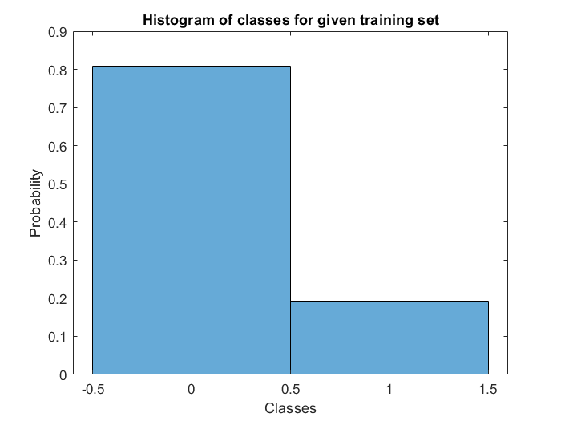
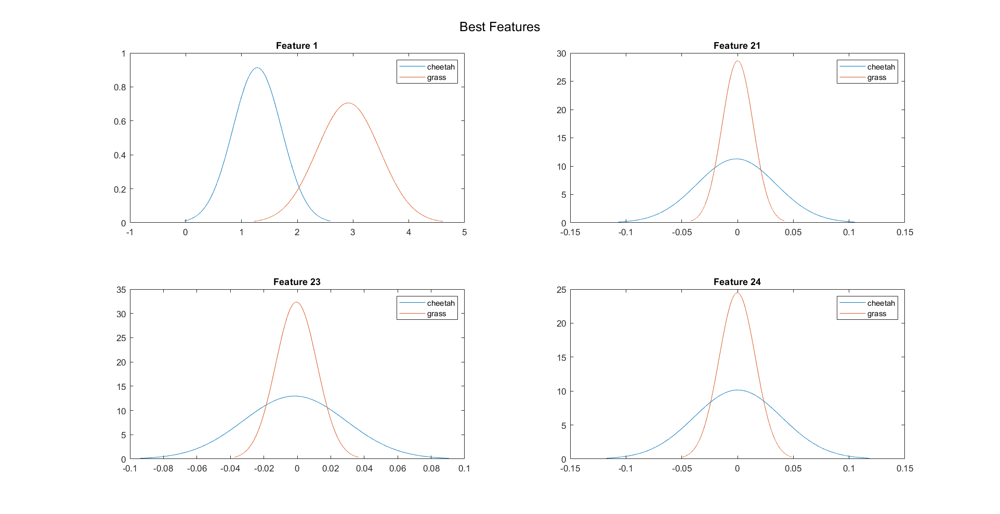
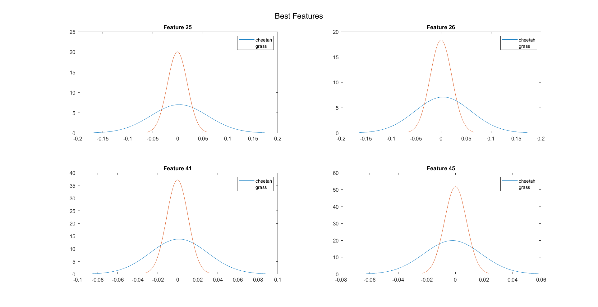
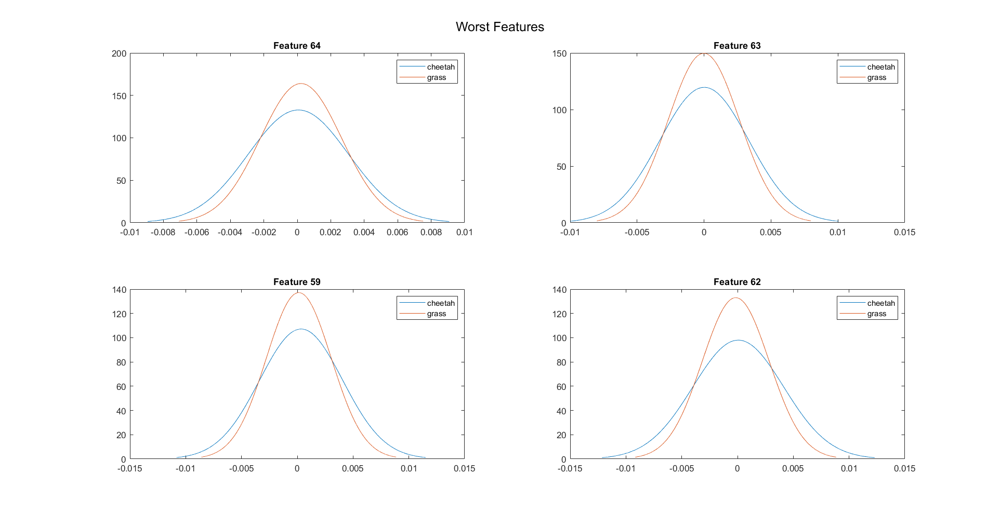
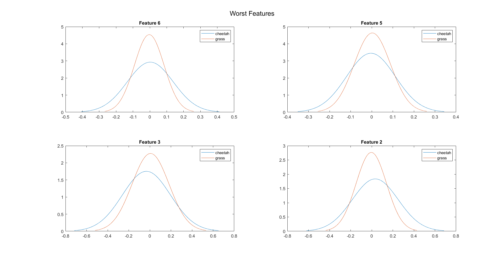
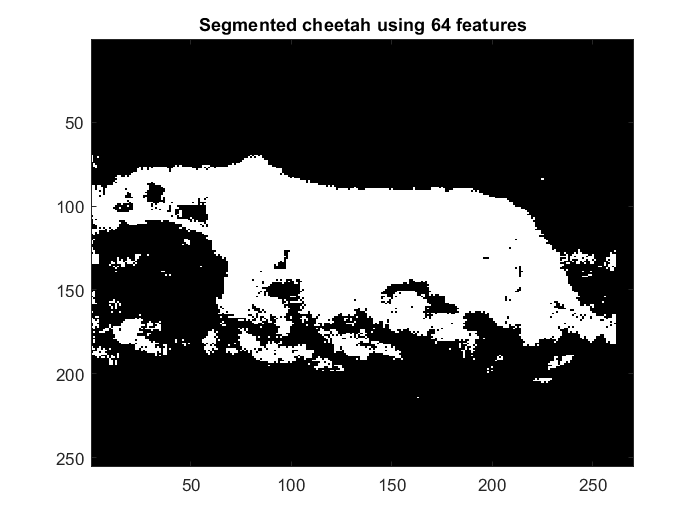
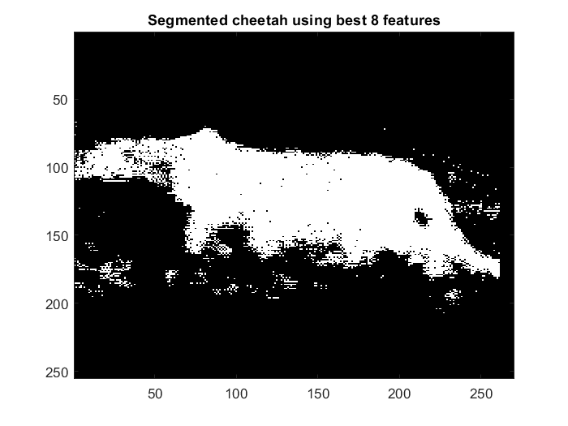

# Maximum Likelihood estimation
## Histogram estimates for prior probabilities
From the training set, the histogram plot for the two classes is obtained as follows:

This histogram plot can be viewed as a multinomial distribution. The observations have a probabilty distribution $P_k = \pi_k$ where $k = {1,2}$. Using the Maximum Likelihood estimate we obtain $\pi_k = c_j \over n$ where $c = \{c_1,c_2\}$ are the number of times that the observed value is $k$.

In this problem $c_1 = 250$, $c_1 = 1053$ and $n = c_1 + c_2 = 1303$
1. Prior probability of cheetah is 
    $P_{y}(cheetah) = P_1 = \pi_1 = {$c_1 \over n} = {250 \over 250+1053} = 0.1919$
2. Prior probability of grass is 
    $P_{y}(grass) = P_2 = \pi_2 = {c_2 \over n} = {1053 \over 250+1053} = 0.8081$

The prior probabilities are the same as the ones that are obtained last week, this is because for the given training set which has only two classes a reasonable estimate for the prior probabilities is equal to the fraction of samples of that respective class in the whole training set. This is equal to the mathematical formula obtained using ML estimate for the multinomial distribution i.e., $\pi_k = {c_j \over n}$, where $c_j$ represents the number of samples of a respective class and $n$ represents the total number of samples in the dataset. 

## Class conditional Densities $P_{X|Y}(x|cheetah)$ and $P_{X|Y}(x|grass)$ \\
ML estimates for multivariate Gaussian distribution are:
$$\mu_i =  {1 \over n} \sum_{j}x_j^{(i)}$$
$$\Sigma_i = {1 \over n} \sum_{j}(x_j^{(i)}-\mu_i)(x_j^{(i)}-\mu_i)^\top$$
Hence from the given training data, for each class we estimate $\mu$ and $\Sigma$ using the above formulas. Since there are 64 features for each sample, the obtained dimensions of $\mu$ and $\Sigma$ are $64\times1$ and $64\times64$ respectively.\\
Using the $\mu$ and the diagonal values of $\Sigma$, marginal densities for each feature
can be plotted. Denoting feature vectors as $X = {X_1,X_2,......,X_64}$ and the marginal densities for the two classes as $P_{X_k|Y}(x_k|cheetah)$ and $P_{X_k|Y}(x_k|grass)$ where $k = 1,2,3,...,64$. After plotting marginal densities for the two classes for all features, by visual inspection i.e., the overlap area and the mean difference between two distributions we can roughly determine the best and worst possible eight features. The plots of the best and worst 8 features obtained from visual inspection are as follows:

## Segmentation of Cheetah
1. Using a $8\times8$ window, we slide through each pixel for the given image.
2. DCT for this $8\times8$ window is computed and then is converted into a feature vector using zig-zag sequence scanning.
3. Based on the problem asked we use all 64 features or the best eight features. Using these features class of the pixel is determined
4. From bayes decision rule,
        $$i^*(x) = argmin_i[d_i(x,\mu_i) + \alpha_i] $$ where
        $$d_i(x,y) = (x-y)^\top\Sigma_i^{-1}(x-y)$$
        $$\alpha_i = log(2\pi)^d|\Sigma_i| - 2logP_Y(i)$$
5. Repeating above steps for each pixel, class is assigned and a segmentation mask is created.

## Final Output
#### Probability of error using 64 is 0.083573$
#### Probability of error using best 8 is 0.051416
The segmented masks obtained by using 64 features and 8 features are as follows:

