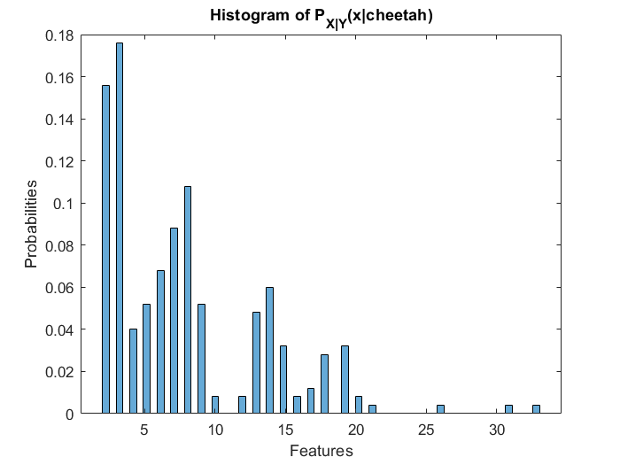
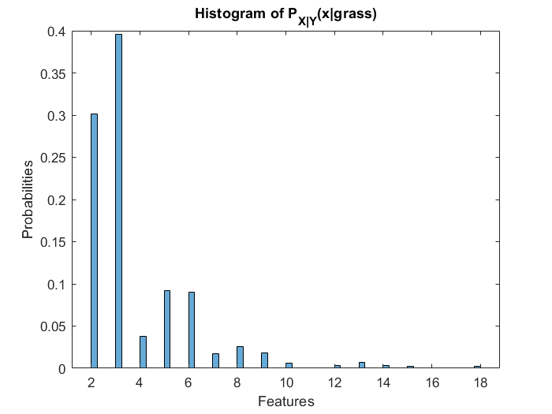

# Naive bayes
## Reasonable estimates for prior probabilities
Prior probabilities are estimated using the training set, where the number of samples for each class are given. So a reasonable estimate for probability of a
class would be the fraction of samples of that respective class in the whole training set.
1. Prior probability of cheetah is:
	$$ P_{y}(cheetah) = number of training samples in foreground \over Total number of samples = 250 \over 250+1053 = 0.1919 $$
2. Prior probability of grass is 
	$$ P_{y}(grass) = number of training samples in background \over Total number of samples  = 1053 \over 250+1053 = 0.8081 $$

## Histograms of $P_{X|Y}(x|cheetah)$ and $P_{X|Y}(x|grass)$
From each training sample, feature is extracted by taking the second maximum element in the given 64 length DCT vector. All the features of a class for the training set are stored in the respective feature array and using the histogram of this array we compute $P_{X|Y}(x|given\_class)$. We use 64 bins to plot all the histograms. Each bar in histogram has edges, using which we can find out the position of a given feature in the histogram and later using this position we can find the frequency of the feature in the training set. Dividing this frequency with total number of samples for that class gives $P_{X|Y}(x|given\_class)$.



## Segmentation of Cheetah
1. Using a $8\times8$ window, we slide through each pixel for the given image.
2. DCT for this $8\times8$ window is computed and then is converted into a feature vector using zig-zag sequence scanning.
3. Feature is taken as the second maximum element from the computed feature vector.
4. $P_{Y|X}(cheetah|x)$ and $P_{Y|X}(grass|x)$ are computed using Bayes rule.
	        $$P_{Y|X}(cheetah|x) = P_{X|Y}(x|cheetah)P_{y}(cheetah)$$
	        $$P_{Y|X}(grass|x) = P_{X|Y}(x|grass)P_{y}(grass)$$
5. From bayes decision rule,
```
if ($P_{Y|X}(cheetah|x)$ >= $P_{Y|X}(grass|x)$){
        y = 1;
}
else{
        y = 0;
}
```
6. Repeating above, class is assigned for each pixel and a segmentation mask is created.

## Final Output
#### Probabilty of error =  0.1699

